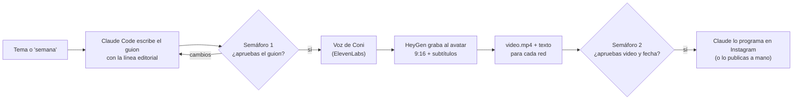

# Claude Code + HeyGen + ElevenLabs: la fábrica de contenido de Coni

Con esta guía, Claude Code escribe guiones con la voz de Coni, manda a grabar a su avatar de
HeyGen con su voz de ElevenLabs y deja cada video listo para revisar. Tú das el tema y apruebas.

> Requisito: haber terminado las sesiones 1 a 7 del curso (`curso-heygen.html`). El gemelo digital
> de Coni tiene que existir en HeyGen y su voz de ElevenLabs tiene que estar importada ahí.
> La sesión 8 del curso es la versión corta de esta guía, escrita para Coni.

## La idea en una imagen

Piensa en un canal de televisión con tres salas:

- **Sala de control → Claude Code.** Lee el brief de Coni, escribe los guiones, da las órdenes y
  lleva el registro de cada video.
- **Estudio de grabación → HeyGen.** Ahí está el gemelo digital de Coni, que "graba" lo que le
  pasan.
- **Cabina de locución → ElevenLabs.** Ahí vive la voz clonada de Coni.

Entre las salas hay dos cables:

- **La CLI `heygen`** es el cable de producción. Por ahí van los pedidos de grabación, con el guion
  exacto, en vertical y con subtítulos.
- **El MCP de HeyGen** es el teléfono. Sirve para preguntar ("¿qué avatares tengo?") y para usar el
  Video Agent de HeyGen, que arma videos más libres a partir de una idea.

Y hay dos semáforos que siempre maneja una persona:

1. **Aprobar el guion** antes de gastar créditos.
2. **Ver el video y aprobar la fecha** antes de que salga. Solo con ese sí, Claude lo programa en
   Instagram vía Metricool.



## Antes de partir

- [ ] Gemelo digital de Coni listo en HeyGen (sesiones 1 a 5 del curso).
- [ ] Voz de ElevenLabs importada en HeyGen (sesión 6 del curso).
- [ ] [Claude Code](https://claude.com/claude-code) instalado en el computador, en la terminal o en la
      app de escritorio. Úsalo en local: en sesiones en la nube, la red puede bloquear HeyGen.
- [ ] Python 3 (viene en macOS y en casi todos los Linux; prueba `python3 --version`).
- [ ] Créditos. Cada video gasta créditos de HeyGen y también de ElevenLabs, porque HeyGen usa la
      llave de ElevenLabs de Coni para hablar con su voz.

## Paso 1 · Abre el proyecto

```bash
git clone https://github.com/wearevision/coniheygen.git
cd coniheygen
claude
```

Al abrirlo, Claude Code lee `CLAUDE.md` (las reglas del proyecto) y ofrece conectar el MCP de
HeyGen que viene en `.mcp.json`. Puedes aceptar ahora o después (paso 3).

## Paso 2 · Conecta el cable de producción (CLI de HeyGen)

```bash
curl -fsSL https://static.heygen.ai/cli/install.sh | bash
heygen auth login
heygen auth status
```

`heygen auth login` te deja elegir cómo pagar:

| Opción | Qué usa | Para quién |
|---|---|---|
| **API key** (se crea en app.heygen.com → Settings → API) | Saldo de API, separado del plan web y de pago por uso | Lo más estable para un agente; sirve también sin nadie mirando |
| **OAuth** (`heygen auth login --oauth`) | Los créditos de tu suscripción de HeyGen (planes Pro o Max) | Si ya pagas un plan y prefieres no tener otro saldo |

La credencial queda guardada por la CLI en `~/.heygen/credentials`, fuera del repo.

## Paso 3 · (Opcional) Conecta el teléfono (MCP de HeyGen)

Ya viene configurado en `.mcp.json`. Dentro de Claude Code escribe `/mcp`, elige **heygen** y
autoriza en el navegador. Usa los créditos de tu plan de HeyGen.

Si prefieres tenerlo en todos tus proyectos:

```bash
claude mcp add --transport http -s user heygen https://mcp.heygen.com/mcp/v1/
```

No es obligatorio: la producción de reels funciona solo con la CLI.

## Paso 4 · Completa la ficha técnica (`coni.config.json`)

Puedes pedírselo a Claude: *"ayúdame a completar coni.config.json"*. Los comandos para listar
avatares y voces ya tienen permiso, así que los corre sin preguntarte. O hazlo a mano:

**El avatar.** HeyGen agrupa los avatares como un clóset: el **grupo** es Coni y cada **look** es
una tenida. El video necesita el ID del look, no el del grupo.

```bash
heygen avatar list --ownership private          # copia el id del grupo de Coni
heygen avatar looks list --group-id <id-grupo>  # copia el id del look (mejor uno vertical)
```

**La voz.** Elige una de dos rutas:

| | Ruta A · `"ruta_voz": "heygen"` | Ruta B · `"ruta_voz": "elevenlabs"` |
|---|---|---|
| Cómo funciona | HeyGen le pide la voz a ElevenLabs y graba | ElevenLabs crea el audio; HeyGen solo mueve los labios |
| Llaves | Solo HeyGen | HeyGen y ElevenLabs (en `.env`) |
| Escuchar antes de pagar el video | No | Sí |
| Ajustes de voz | Los principales (modelo, estabilidad, similitud, estilo) | Todos los de ElevenLabs |
| Cuándo usarla | Por defecto | Si tu voz no aparece en HeyGen o quieres máxima fidelidad |

- **Ruta A:** `heygen voice list --type private` y copia el `voice_id` de la voz que se llama como
  en ElevenLabs. Va en `heygen.voice_id`.
- **Ruta B:** copia `.env.example` como `.env` y pega tu `ELEVENLABS_API_KEY`. El ID de la voz
  (en ElevenLabs, en Voices, abre el menú de tu voz y copia su ID) va en `elevenlabs.voice_id`.

El resto de la ficha ya viene listo para redes: vertical 9:16, 1080p y subtítulos incrustados.

## Paso 5 · Verifica

```bash
python3 scripts/coni.py verificar
```

Cuando todo está bien, se ve así:

```
Ficha técnica
  ✔ ruta_voz = heygen
  ✔ heygen.avatar_id completo
  ✔ heygen.voice_id completo

HeyGen
  ✔ CLI de HeyGen instalada
  ✔ Sesión iniciada en la CLI
  ✔ Avatar encontrado: Coni consulta · digital_twin
  ✔ Avatar listo para usar
  ✔ Voz encontrada en HeyGen: Coni

Todo listo.
```

Cada ✘ trae la instrucción para resolverlo.

## Uso diario

Dentro de Claude Code:

| Escribes | Pasa esto |
|---|---|
| `/reel-coni celos en parejas largas` | Un video sobre ese tema |
| `/reel-coni semana 3` | Tres ideas de pilares distintos, con los tres guiones para aprobar de una vez |
| `/reel-coni render contenido/2026-09-29-celos` | Graba un guion que ya aprobaste |
| `/reel-coni programar contenido/2026-09-29-celos` | Programa en Instagram un video que ya viste (pide la fecha) |
| `/reel-coni informe` | Informe semanal con los números de Instagram y temas propuestos |

También funciona pedirlo con tus palabras: *"hazme un reel de Coni sobre el deseo en parejas largas"*.

Qué hace Claude, en orden:

1. Lee la línea editorial y revisa qué temas ya se hicieron.
2. Crea la carpeta del video y escribe el guion y el texto para cada red.
3. **Te muestra el guion y espera tu sí.** Hasta aquí, cero créditos.
4. Genera la voz (Ruta B) y arma el pedido para HeyGen.
5. Manda a grabar y espera. Un reel suele tardar algunos minutos.
6. Descarga `video.mp4` y, si corresponde, `video-subtitulado.mp4`.
7. **Te entrega el video y pregunta si lo apruebas y para qué fecha.** Con tu sí, lo programa en
   Instagram vía Metricool. También puedes publicarlo a mano.

Cada comando que gasta créditos o publica (`heygen video create`, `heygen asset create`,
`coni.py voz` y la programación en Metricool) te pide permiso en pantalla: el botón de grabar
siempre lo aprieta una persona. Cuando ya confíes en el flujo, puedes aprobar para siempre los de
HeyGen desde ese mismo aviso. La programación en Metricool conviene dejarla siempre con aviso.

## Dónde queda cada cosa

```
contenido/
├── linea-editorial.md      el brief de Coni: pilares, tono y reglas (edítalo cuando quieras)
└── 2026-09-29-celos/
    ├── ficha.md            estado e IDs
    ├── guion.txt           lo que dice el avatar
    ├── publicacion.md      textos para Instagram/TikTok y LinkedIn
    ├── pedido.json         lo que se le pidió a HeyGen
    ├── render.json         la respuesta de HeyGen con los links
    └── video.mp4           el video (no se sube a git)
```

## Costos de referencia

- **Video directo por la API** (lo que usa `/reel-coni`): unos US$0,033 por segundo, según las
  skills oficiales de HeyGen (julio de 2026). Un reel de 45 segundos cuesta cerca de US$1,5.
- **Video Agent** (lo que usa el MCP para armar videos a partir de una idea): unos US$0,10 por
  segundo, alrededor de tres veces más.
- Con OAuth se descuentan créditos del plan en vez de saldo de API. Confirma los valores vigentes
  en app.heygen.com antes de producir en volumen.

## Problemas frecuentes

| Síntoma | Qué hacer |
|---|---|
| "Avatar no encontrado" | Pusiste el ID del grupo. Usa el del look (`heygen avatar looks list`). |
| La voz no aparece en `heygen voice list --type private` | Revisa la sesión 6 del curso y los permisos de la llave de ElevenLabs, o cambia a la Ruta B. |
| Error de autenticación (código 3) | `heygen auth login` otra vez. |
| La voz suena con acento gringo | Usa un modelo multilingüe (`eleven_multilingual_v2` o `eleven_v3`). |
| HeyGen rechaza el video por contenido | Claude reescribe el guion con un encuadre más clínico y te lo vuelve a mostrar. |
| `esperar` dice "sigue en proceso" | Es normal. Claude vuelve a correrlo. |
| Se acabaron los créditos de ElevenLabs | La voz deja de funcionar en HeyGen hasta recargar. |

## Paso 6 · (Opcional) Conecta Instagram con Metricool

Con esto, Claude programa los Reels en Instagram después del segundo semáforo.

1. El Instagram de Coni debe ser **cuenta profesional** (de empresa o de creador).
2. Crea la marca de Coni en **Metricool** y conecta su Instagram desde ahí.
3. En Claude Code, `/mcp` → **metricool** → autoriza en el navegador. El conector ya viene en `.mcp.json`.
4. Prueba: *"¿qué cuentas tengo conectadas en Metricool?"*.

El proceso completo, con roles, ritmo semanal, métricas y detalles de Instagram, está en
[`METODOLOGIA-CONTENIDO.md`](METODOLOGIA-CONTENIDO.md).

## Fuentes

- [HeyGen · MCP para Claude Code](https://developers.heygen.com/mcp/claude-code)
- [HeyGen · CLI oficial (código y documentación)](https://github.com/heygen-com/heygen-cli)
- [HeyGen · Skills oficiales para agentes](https://github.com/heygen-com/skills)
- [HeyGen · API v3 de videos](https://developers.heygen.com/docs)
- [HeyGen · Cómo integrar voces de ElevenLabs](https://help.heygen.com/en/articles/8310663-how-to-integrate-elevenlabs-other-third-party-voices)
- [ElevenLabs · API de texto a voz](https://elevenlabs.io/docs/api-reference/text-to-speech/convert)
