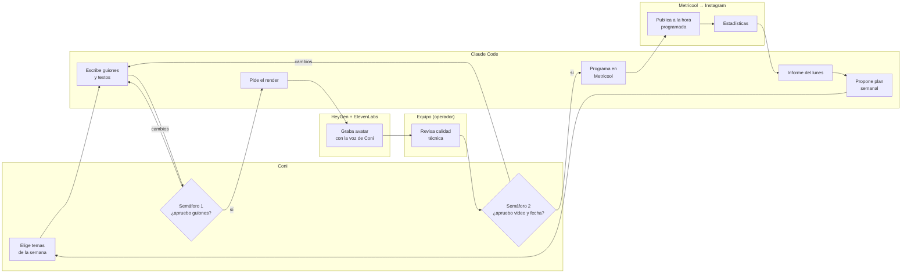

# Metodología: del guion al aire

Cómo funciona, semana a semana, la producción de contenido de Coni con Claude Code, HeyGen,
ElevenLabs e Instagram. Aquí se explica **el proceso**: quién hace qué, cuándo y con qué control.
La instalación paso a paso está en [`GUIA-CLAUDE-CODE-HEYGEN.md`](GUIA-CLAUDE-CODE-HEYGEN.md).

> **Estado a septiembre de 2026:** el repo cubre desde la idea hasta el Reel programado en
> Instagram. La conexión vía Metricool está **activada en el repo** (paso 9 y modo `informe` de
> `/reel-coni`). Para usarla falta autorizarla con la cuenta de Coni: pasos 1 a 4 de la sección
> [Instagram](#instagram-se-puede-integrar).

## La idea en una imagen

Es el mismo canal de televisión de la guía de instalación, con dos salas más al final del pasillo:

| Sala | Herramienta | Qué hace |
|---|---|---|
| Sala de control | **Claude Code** | Planifica, escribe, da órdenes y lleva el registro |
| Cabina de locución | **ElevenLabs** | Pone la voz clonada de Coni |
| Estudio | **HeyGen** | Graba a la gemela digital con esa voz |
| Sala de emisión | **Metricool → Instagram** | Programa y publica a la hora indicada |
| Medición de audiencia | **Metricool** (estadísticas) | Cuenta qué funcionó, para decidir la semana siguiente |

Y hay dos **semáforos** que solo cambia una persona:

1. **Semáforo 1:** nada se graba sin un guion aprobado.
2. **Semáforo 2:** nada sale al aire sin que alguien haya visto el video y aprobado la fecha.

## El mapa del proceso

Cada carril es un responsable. Las flechas muestran por dónde avanza cada video:



## Las siete estaciones

| # | Estación | Qué pasa | Responsable | Herramienta | Entregable |
|---|---|---|---|---|---|
| 1 | **Planificar** | Propone temas equilibrando pilares, con lo que funcionó la semana anterior | Claude propone, Coni elige | `/reel-coni semana 3` | Lista de temas |
| 2 | **Escribir** | Guion con la voz de Coni y textos para cada red | Claude | Línea editorial | `guion.txt`, `publicacion.md` |
| ◆ | **Semáforo 1** | Aprobación de guiones, uno a uno o en lote | Coni | Chat de Claude | Ficha en "aprobado" |
| 3 | **Producir** | Voz, avatar, formato 9:16 y subtítulos | Claude → HeyGen | CLI `heygen`, `scripts/coni.py` | `video.mp4` |
| 4 | **Revisar** | Control técnico: labios, pronunciación, cortes, subtítulos | Equipo | Checklist de abajo | Ficha en "listo para revisar" |
| ◆ | **Semáforo 2** | Coni ve el video y aprueba el día y la hora | Coni | Chat o link de HeyGen | Fecha aprobada |
| 5 | **Programar** | Deja el Reel agendado en Instagram | Claude | MCP de Metricool | Ficha en "programado" |
| 6 | **Medir** | Informe semanal con los números de cada pieza | Claude | Estadísticas de Metricool | Informe del lunes |
| 7 | **Aprender** | Propone ajustes a pilares, ganchos o formatos | Claude propone, Coni decide | `contenido/linea-editorial.md` | Línea editorial actualizada |

### Checklist técnico de la estación 4

- [ ] Los labios calzan con la voz de principio a fin.
- [ ] Nombres propios y palabras difíciles bien pronunciadas ("Ring", "sexóloga", "apego").
- [ ] Sin cortes raros, congelamientos ni gestos extraños.
- [ ] Subtítulos sin errores y dentro del cuadro vertical.
- [ ] El cierre dice que es un avatar digital.
- [ ] Dura menos de 90 segundos (la pestaña de Reels solo muestra videos de 5 a 90 segundos).

## Quién hace qué

| Tarea | Coni | Equipo | Claude |
|---|---|---|---|
| Decidir temas y tono | **Decide** | Opina | Propone |
| Escribir guiones y textos | Aprueba | — | **Hace** |
| Grabar con el avatar | — | Supervisa costos | **Hace** |
| Revisión técnica del video | — | **Hace** | Avisa qué mirar |
| Aprobar publicación | **Decide** | — | Pregunta |
| Programar en Instagram | — | Supervisa | **Hace** (solo con aprobación) |
| Leer resultados y ajustar | **Decide** | Opina | Propone |

"Equipo" es quien opera Claude Code. Puede ser la misma persona que Coni, pero conviene que haya
un segundo par de ojos en la revisión técnica.

## La escalera de automatización

No hay que automatizarlo todo el primer día. Cada peldaño se sube cuando el anterior anda sin sustos:

| Nivel | Nombre | Qué hace Claude | Qué hace una persona | Estado |
|---|---|---|---|---|
| 0 | Manual | Nada | Todo, en HeyGen (el curso) | Aprendido |
| 1 | Producción asistida | Escribe, graba y entrega el video | Aprueba y publica a mano | **Hoy** |
| 2 | Programación asistida | Además programa en Metricool | Aprueba cada video y su fecha | Listo; falta autorizar Metricool |
| 3 | Semana en lote | Planifica, produce y programa la semana, y trae el informe | Aprueba en dos momentos por semana | Meta |
| 4 | Piloto automático | Publica sin preguntar | Nada | **No recomendado** |

El nivel 4 queda fuera a propósito. Coni habla como psicóloga sobre temas sensibles, y su nombre
está en cada video: siempre debe haber una persona entre el guion y el aire.

## El ritmo de la semana (nivel 3)

| Día | Qué pasa | Tiempo de Coni (estimado) |
|---|---|---|
| Lunes | Claude trae el informe de la semana anterior y propone temas. Coni elige | 10 min |
| Martes | Claude escribe los guiones. Coni los aprueba o pide cambios (semáforo 1) | 15 min |
| Miércoles | Claude graba, y el equipo hace la revisión técnica | 0 min |
| Jueves | Coni ve los videos y aprueba las fechas (semáforo 2). Claude programa | 15 min |
| Viernes a domingo | Instagram publica según lo programado | 0 min |

Total aproximado para tres reels semanales: **40 minutos de Coni por semana**.

## El recorrido de cada video

Cada video vive en su carpeta `contenido/AAAA-MM-DD-tema/`, y su `ficha.md` dice en qué estación va:

`idea` → `guion por aprobar` → `aprobado` → `en render` → `listo para revisar` → `programado` → `publicado`

Claude pasa la ficha a `programado` cuando deja el Reel en Metricool, y a `publicado` en el informe
semanal, cuando la fecha ya pasó. Si alguien publica a mano, marca `publicado` directamente.

## Métricas

Hay dos tipos de números: los que muestran si **la fábrica** funciona y los que muestran si **el
contenido** funciona.

| Métrica | Qué mide | Fuente | Señal de alerta |
|---|---|---|---|
| Videos por semana | Capacidad | Carpetas en `contenido/` | Menos de lo planificado dos semanas seguidas |
| Idea → publicado | Velocidad | Fechas de la ficha | Más de 7 días |
| Aprobados a la primera | Si los guiones suenan a Coni | Fichas | Menos de 60 %: ajustar la línea editorial |
| Costo por video | Plata | HeyGen y ElevenLabs | Sobre el presupuesto mensual |
| Alcance y reproducciones | Si llega a gente nueva | Metricool | — |
| Tiempo promedio de reproducción | Si el gancho y el ritmo retienen | Metricool | Muy por debajo de la duración del video |
| Guardados y compartidos | Si le sirvió a alguien | Metricool | — |
| Visitas al perfil y clics en el link | Si genera interés en el taller o la consulta | Metricool | — |

**El ciclo de aprendizaje:** cada cuatro semanas, Claude compara pilares, formatos y ganchos, y
propone uno o dos cambios concretos a la línea editorial. Coni decide si se aplican.

## Instagram: ¿se puede integrar?

**Sí.** Instagram permite publicar Reels por API. Meta no ofrece un conector oficial para que
Claude publique contenido orgánico (su conector oficial es solo para anuncios), así que hay tres rutas:

| Ruta | Cómo funciona | Ventajas | Desventajas |
|---|---|---|---|
| **A. Metricool (recomendada)** | Conector MCP oficial de Metricool. Claude programa el Reel en el calendario de Metricool | Instalación en 5 minutos, sin código. Calendario visual para Coni. Estadísticas y mejores horarios dentro de Claude | Requiere cuenta de Metricool. Hay que revisar qué plan incluye el conector |
| B. Buffer | Conector MCP de Buffer (`https://mcp.buffer.com/mcp`), lanzado en mayo de 2026 y gratis en todos los planes | Gratis | Falta confirmar que publique Reels con video; sin estadísticas tan completas |
| C. API directa de Instagram | Un script propio habla con la API de Meta | Sin terceros | Requiere una app en Meta for Developers, renovar tokens cada 60 días y un programador de horarios propio |

### Ruta A: cómo se conecta Metricool

1. **Cuenta profesional.** El Instagram de Coni tiene que ser cuenta de empresa o de creador
   (Configuración → Tipo de cuenta y herramientas). Es un requisito de Meta para publicar por API.
2. **Metricool.** Crea la marca de Coni en Metricool y conecta su Instagram desde ahí.
3. **Conector en Claude Code.** Ya viene configurado en `.mcp.json`. Al abrir el proyecto, Claude
   Code ofrece activarlo. Si no lo hace, escribe `/mcp`, elige **metricool** y autoriza en el navegador
   con la cuenta de Metricool (OAuth, sin llaves que copiar). Para tenerlo en todos tus proyectos:

   ```bash
   claude mcp add --transport http -s user metricool https://mcp.metricool.ai/mcp
   ```
4. **Prueba.** Pídele a Claude *"¿qué cuentas tengo conectadas en Metricool?"* y después *"¿cuál es
   el mejor horario para publicar en Instagram esta semana?"*. La primera vez que programe, Claude
   te pedirá elegir la marca de Coni y anotará su ID en `coni.config.json`.

### Qué cambia en el flujo

- Después del semáforo 2, Claude usa la herramienta `create_scheduled_post` de Metricool con el video,
  el texto de `publicacion.md`, la fecha aprobada y la zona horaria de Chile (`America/Santiago`).
- Metricool devuelve un link al calendario. Claude lo anota en la ficha y la pasa a `programado`.
- Hasta la hora de publicación, el Reel se puede revisar, editar o borrar desde el calendario de
  Metricool. Es una red de seguridad adicional, no un reemplazo del semáforo 2.
- Órdenes nuevas: `/reel-coni programar <carpeta>` programa un video que ya revisaste, y
  `/reel-coni informe` trae el informe semanal con los números de Instagram.

### Detalles a cuidar

- **Link del video.** Metricool recibe el video como un link público. Los links de HeyGen son
  temporales, así que Claude debe pedir uno fresco (`heygen video get`) justo antes de programar.
  En la primera prueba hay que confirmar que Metricool guarda su propia copia. Si no la guarda, el
  video debe subirse a un almacenamiento con link estable.
- **Duración y formato.** Reels verticales 9:16 de 5 a 90 segundos, que es justo lo que produce la fábrica.
- **Etiqueta de IA.** La transparencia ya va en el cierre del video y en el texto. Además, Instagram
  tiene su propia etiqueta "Información de IA". Hay que confirmar si Metricool permite activarla y,
  si no, activarla desde la app.
- **Límite de publicaciones.** Meta limita las publicaciones por API a unas decenas por cuenta cada
  24 horas. Con tres reels a la semana no es un problema.

### La regla de oro

**Claude programa solo con una aprobación explícita del video y de la fecha.** Está escrito en
`CLAUDE.md` y en la skill:

- Un "ok" al video no basta: tiene que haber día y hora.
- Nunca publica de inmediato; deja al menos 15 minutos de margen.
- No programa en otras redes sin que se lo pidan y no responde comentarios.
- Crear o editar una publicación pide permiso en pantalla. Leer estadísticas no.

## Riesgos y controles

| Riesgo | Control |
|---|---|
| Un guion dice algo impreciso o sensible | Semáforo 1, más las reglas de la línea editorial (sin diagnósticos, sin pacientes, sin cifras inventadas) |
| El video sale con fallas | Revisión técnica, más el semáforo 2 |
| HeyGen rechaza el guion por moderación | Claude reformula con encuadre clínico y vuelve al semáforo 1 |
| Gasto descontrolado | Cada comando que gasta créditos pide permiso. Presupuesto mensual en las métricas |
| Una publicación genera reacciones negativas | Pausar los programados desde el calendario de Metricool, y que Coni decida cómo responder. Claude no responde comentarios |
| Se filtra una llave | Las llaves viven fuera del repo (`heygen auth login`, `.env`, OAuth). Si se filtra, se revoca y se crea otra |
| Se corta un conector (HeyGen o Metricool) | `python3 scripts/coni.py verificar` y la reconexión con `/mcp` en Claude Code |

## Hoja de ruta

- **Semana 1 · Nivel 1.** Completar `coni.config.json`, tener `verificar` en verde y producir el
  primer reel (el guion del taller ya está aprobado). Publicarlo a mano.
- **Semana 2 · Nivel 2.** Pasar Instagram a cuenta profesional, crear la marca en Metricool,
  autorizar el conector y programar el segundo reel desde Claude.
- **Semanas 3 y 4 · Nivel 3.** Primera semana en lote (`/reel-coni semana 3`), primer informe del
  lunes y revisión del ritmo con Coni.
- **Semana 8.** Primer ciclo de aprendizaje: ajustar la línea editorial con los números.

## Fuentes

- [Metricool · conector MCP oficial (endpoint, herramientas y configuración)](https://github.com/vicampuzano/metricool-mcp)
- [Metricool · Cómo conectar Claude a Instagram](https://metricool.com/connect-claude-to-instagram/)
- [Meta · Publicar contenido con la plataforma de Instagram](https://developers.facebook.com/docs/instagram-platform/content-publishing/)
- [Instagram MCP: no hay servidor oficial de Meta](https://www.usecarly.com/blog/instagram-mcp/)
- [Buffer · MCP y API pública (2026)](https://www.socialync.io/mcp-server/buffer)
- [Límites de publicación de la API de Instagram](https://bundle.social/blog/instagram-api-rate-limits)
- [Especificaciones de Reels por API](https://www.getphyllo.com/post/a-complete-guide-to-the-instagram-reels-api)
